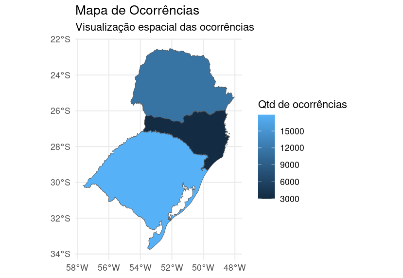
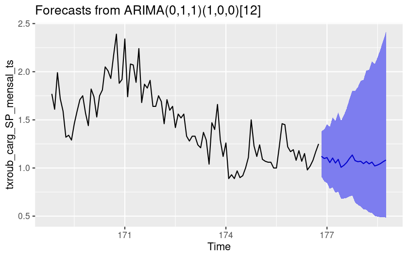
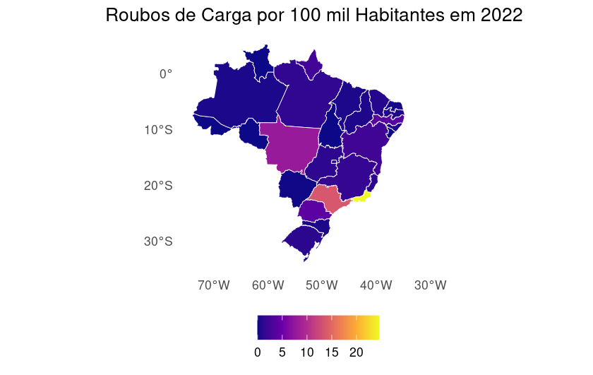

# BrazilCrime

<!-- badges: start -->
[](https://github.com/GiovanniVargette/BrazilCrime/blob/master/LICENSE) 
[](https://cran.r-project.org/package=BrazilCrime)
[](https://CRAN.R-project.org/package=BrazilCrime)
[](https://CRAN.R-project.org/package=BrazilCrime)
<!-- badges: end -->


## Roadmap de desenvolvimento

- [X]  Inclusão de shapes dos estados e argumento booleano para retornar dados espacializados;

- [X]  Adicionar argumento booleano para retornar o formato da tabela diferente com o tidyr;

- [X]  Inclusão de argumento booleano para retornar o número de ocorrências a cada 100 mil habitantes (dados de projeções mensais provenientes das [projeções](https://www.ibge.gov.br/estatisticas/sociais/populacao/9109-projecao-da-populacao.html?=&t=downloads) do IBGE); 

- [X] Adicionar testes para as funções;

- [X]  Adição da função que coleta os dados divulgados na plataforma [gov.br](https://www.gov.br/mj/pt-br/assuntos/sua-seguranca/seguranca-publica/estatistica/dados-nacionais-1/base-de-dados-e-notas-metodologicas-dos-gestores-estaduais-sinesp-vde-2022-e-2023) disponibilizados pelo Ministério da Justiça (Sinesp-VDE); 

- [X]  Subir versão inicial para o CRAN;

- [ ] Incluir dados populacionais anuais por município e interpolar dados por mês para o argumento relative_values da função get_sinesp_vde_data; e

- [ ] Adicionar microdados do SUS com estatísticas sobre violência (agressões).


## Sobre o projeto

A principal função do pacote BrazilCrime é disponibilizar de maneira acessível os dados sobre criminalidade e violência do Brasil, através da linguagem R.

Para isso coleta-se as informações divulgadas pelo Sistema Nacional de Informações de Segurança Pública (Sinesp), órgao do Ministério da Justiça e Segurança Pública, esses dados são organizados em um data frame e disponibilizados ao usuário.

Nessa primeira versão, temos disponível dados a partir de janeiro de 2015 até dezembro de 2022, em estratificação por unidade federativa, para as seguintes tipologias criminais: Estupro, Furto de Veículo, Homicídio Doloso, Lesão Corporal Seguida de Morte, Roubo a Insituição Financeira, Roubo de Carga, Roubo de Veículo, Roubo Seguido de Morte (Latrocínio) e Tentativa de Homicídio.


# Instalação do Pacote

Versão oficial no CRAN:

```r
install.packages("BrazilCrime")
library(BrazilCrime)
```

Versão de desenvolvimento:

```r
install.packages("devtools")
devtools::install_github("GiovanniVargette/BrazilCrime")
library(BrazilCrime)
```


# Exemplos de uso das funções

Baixar todos os dados do SINESP entre 2015 e 2022 com granularidade mensal.

```r
dados <- get_sinesp_data() 
```

Baixar todos os dados do SINESP entre 2015 e 2022 com granularidade anual.

```r
dados <- get_sinesp_data(granularity = 'year') 
```

Baixar todos os dados do SINESP de 2018 e 2019 sobre homicídio doloso para os 
estados de São Paulo, Rio de Janeiro e Minas Gerais com granularidade mensal.

```r
dados <- get_sinesp_data(state = c('RJ', 'SP', 'MG'),
                         typology = 'Homicídio doloso',
                         year = c(2018, 2019))
```

#### Exemplo 1: Baixar os dados dos estados do Sul do Brasil sobre roubo de veículos para o ano de 2022 com granularidade anual e com os vetores espaciais das UFs.

```r
data_sul <- get_sinesp_data(state = c('PR','SC','RS'),
                            typology = 'Roubo de veículo',
                            year = 2022,
                            geom = T,
                            granularity = 'year')

# criar o mapa
library(ggplot2)
ggplot(data = data_sul) +
  geom_sf(aes(fill = ocorrencias)) + 
  theme_minimal() +
  labs(title = "Mapa de Ocorrências",
       subtitle = "Visualização espacial das ocorrências",
       fill = "Qtd de ocorrências")
```



#### Exemplo 2: Taxa mensal de roubo de carga ocorridos em SP de 2015 a 2022

```
txroub_carg_SP_mensal_ts <- get_sinesp_data(state = 'sp', 
                                            typology = 'roubo de carga',  
                                            granularity = 'month', 
                                            relative_values = TRUE)

names(txroub_carg_SP_mensal_ts)


# Transformar para objeto ts (time series)
txroub_carg_SP_mensal_ts <- ts(txroub_carg_SP_mensal_ts[,8], 
                               start = c(1, 2015),
                               frequency = 12)

# Estimando um modelo ARIMA pelo auto.arima 
(mod_auto <- auto.arima(txroub_carg_SP_mensal_ts, 
                        lambda = 0, # transf. log
                        stepwise = TRUE, 
                        trace = TRUE, 
                        approximation = FALSE, 
                        allowdrift = TRUE, 
                        allowmean = TRUE,
                        test = "kpss",
                        ic = c("bic")))

# Análise visual dos resíduos
par(mfrow=c(2,2))
plot(mod_auto$residuals, main="Resíduos", col=2)
Acf(mod_auto$residuals, main="Resíduos", col=4)
Acf((mod_auto$residuals)^2, main="Resíduos ao quadrado", col=4)
plot(density(mod_auto$residuals,
             kernel = c("gaussian")), 
     main="Resíduos", col=6) 


# Testes formais nos resíduos

# Autocorrelação
Box.test(mod_auto$residuals,
         lag=4, 
         type="Ljung-Box", 
         fitdf=2) 

Box.test(mod_auto$residuals,
         lag=8, 
         type="Ljung-Box", 
         fitdf=2) 

Box.test(mod_auto$residuals,
         lag=12, 
         type="Ljung-Box", 
         fitdf=2)   

# Heterocedasticidade condicional
ArchTest(mod_auto$residuals, lags=4) 
ArchTest(mod_auto$residuals, lags=8)
ArchTest(mod_auto$residuals, lags=12) 

# Normalidade
shapiro.test(mod_auto$residuals)

# Previsões
forecast(mod_auto, h=24, level=95)

autoplot(forecast(mod_auto, h=24, level=95))
```




#### Exemplo 3: Roubo de carga a cada 100 mil habitantes por UF em 2022
```
q <- get_sinesp_data(
  typology = 'roubo de carga',
  granularity = 'year',
  year = 2022,
  relative_values = TRUE,
  geom = TRUE)

ggplot(data = q) +
  geom_sf(aes(fill = ocorrencias_100k_hab), color = 'white') +
  scale_fill_viridis_c(option = "plasma", na.value = "white", name = NULL) +  
  labs(
    title = "Roubos de Carga por 100 mil Habitantes em 2022",
    fill = "Ocorrências por 100k Habitantes"
  ) +
  theme_minimal() +
  theme(
    legend.position = "bottom",            
    legend.direction = "horizontal",         
    legend.title = element_blank(),         
    panel.grid = element_blank(),
    plot.title = element_text(hjust = 0.5)
  )
```



# Agradecimentos

Marcelo Justus agradece ao CNPq pela Bolsa de Produtividade em Pesquisa (processo nº 312685/2021-1), que viabilizou a realização deste trabalho. Giovanni agradece ao CNPq pelas Bolsas de Iniciação Científica recebidas de 2023 a 2025, fundamentais para sua participação neste projeto.

# Citação

Para citar em trabalhos utilize:

```bash
citation("BrazilCrime)

#To cite package ‘BrazilCrime’ in publications use:

#  Vargette G, Justus M, Laltuf I (2024). _BrazilCrime: Crime data from Brazil_. R
#  package version 0.0.2, <https://github.com/GiovanniVargette/BrazilCrime>.

#A BibTeX entry for LaTeX users is

#  @Manual{,
#    title = {BrazilCrime: Crime data from Brazil},
#    author = {Giovanni Vargette, Marcelo Justus and Igor Laltuf},
#    year = {2024},
#    note = {R package version 0.0.3},
#    url = {https://github.com/GiovanniVargette/BrazilCrime},
#  }

```
